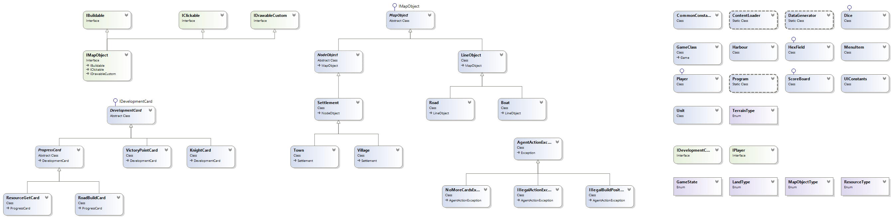

# Team Monster teamwork part of Object-oriented Programming 2016 course in Telerik Academy
----------------------------------

##Team members:

 1. Dimitar Kirov - dimkirov
 2. Simeon Tzvetkov - STzvetkov
 3. Tsvetoslav Lazarov - Tsvetoslav_Lazarov
 4. Silvia Boteva - sboteva1

##GitHub repository
https://github.com/DimitarDKirov/TeamMonster

##Telerik Academy Showcase System place
http://best.telerikacademy.com/projects/279/Catan-OOP-Team-project-of-team-Monster

##Project description
This project is a simple implementation of the board game "The Settlers of Catan". The GUI is based on MonoGame. In this case 4 players share the same mouse/keyboard/screen The initial menu consists of 3 options: New Game, About and Exit. 

The user may open the menu at any time by pressing key M. Selection is changed by Up and Down arrow keys and selected option could be activated on Enter press. The game screen shows the island surrounded by ocean. The island is divided in 19 hexagon fields randomly divided in 6 groups by the resource they can produce to the player whose villages are located on the hex field edges. Initially each player must locate roads and villages in the order: village - road - village - road. Villages could be located only on the edges of the hex field and the roads - on it's sides.

The villages and roads of each player are colored like player's color: red, blue, green, yellow.
Once the last player builds his initial roads and villages, the active state f the game begins. Each player roll the dices by clicking on them. Depending on their sum the player can get resources from the fields his villages are located on or if he has enough points to build additional settlement.

The first player who gathers 10 points wins the game. This is implements with event, raised by the player and received by the game engine.
Further options are available by the usage of development cards. Their hierarchy exists in the class structure, but this functionality is not implemented yet.

##Class diagram

